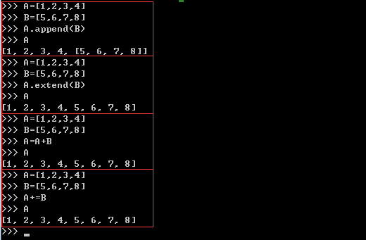

### Python小坑记录  
* 布尔值首字母大写 True False
* dict类型默认是无序的，需要用
* collections.OrderedDict()
* dict key为空时不能进行+=操作,必须先has_key('key_name') 或者 if key_name in dict.keys()
* 查找字符串最后一次出现的位置,rfind
* 判断子字符串是否存在, 
    * for 'word' in string
    * string.find('word')
    * string.index('word') > -1 (不存在会返回-1,在字符串截取的时候需要注意下)
* python的抬头编码声明, #coding = utf-8
* python没有switch语法
* 逻辑运算符是 and or 而不是 ||之类的，看来是崇尚自然的表达
* python没有自增只有 i += 1
* r'字符串'的作用是 取消字符串里面特殊转义，比如\n。' " ''' 三种引号没有根本区别，都会直接执行转义字符，只是为了彼此包含更方便。变量都不能在引号中输出值，只能使用占位符的方式。不用r的话，只能是 '\\n'，手动转义
* re.match 是全局匹配，re.search是局部查找，compile正则式应该是为了复用，一次性的话可直接match/search， str.find()找不到返回-1，str.find()找不到就抛异常
* 用%占位符来代替 + 拼接字符串， '%s and %d' % ('aa', 12)
* python整型有两种int 和 长整型，长整型不需要声明，两者会直接转换，可保存超长的基于操作系统的整型
* [python中没有switch](https://www.pydanny.com/why-doesnt-python-have-switch-case.html)
```python
def numbers_to_strings(argument):
    switcher = {
        0: "zero",
        1: "one",
        2: "two",
    }
    return switcher.get(argument, "nothing")
```
* py自带chm在win2安装目录下
* 在python中，strings, tuples, 和numbers是不可更改的对象，而list,dict都是引用。所以当函数传入一个list或者dict时，改变参数，也就改变了原始值
* [如果想拿到list完全一样的值，但是又不是同一个引用，有三种方式：](http://www.cnblogs.com/wait123/archive/2011/10/10/2206580.html)，其中又分浅拷贝和深拷贝
```python
#1）完全切片操作；
#2）利用工厂函数，比如list()等；
# 3）使用copy模块中的copy（）函数
a = [0,1]
b = a[:]
b = list(a)
```
* 完全面向对象的意思是：即使只有一行代码，想要跑起来，它也必须在一个类里面。
* 字符串转换有两个函数， str repr，str在转换浮点数时会丢失，而repr是原样，并且可以被eval回去
```python
import time
msec = sepr(time.time()).replace('.', '') # 获取尾部三位毫秒，去掉.
```
* [python合并列表，append()/extend()/+/+=的区别](http://www.cnblogs.com/meitian/p/4649173.html)
1. append()  向列表尾部追加一个新元素，列表只占一个索引位，在原有列表上增加
2. extend() 向列表尾部追加一个列表，将列表中的每个元素都追加进来，在原有列表上增加
3. +直接用+号看上去与用extend()一样的效果，但是实际上是生成了一个新的列表存这两个列表的和，只能用在两个列表相加上
4. += 效果与extend()一样，向原列表追加一个新元素，在原有列表上增加

###常用语法
* range(a,b,c)生成不含b，默认步长为c的列表，eg tmp = [x for x in range(2,10)]
* random.shuffle()打乱一个列表的内部，不需要接值
* for i in list:遍历列表
* 拼接要同一类型，用int/str函数转类型
* 想要一一对应可用map数据结构，提取key，再打乱，用get函数定位值
* import导入类库，不需要写后缀名和引号